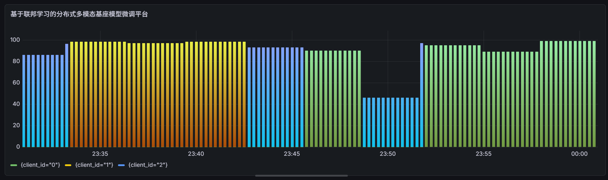
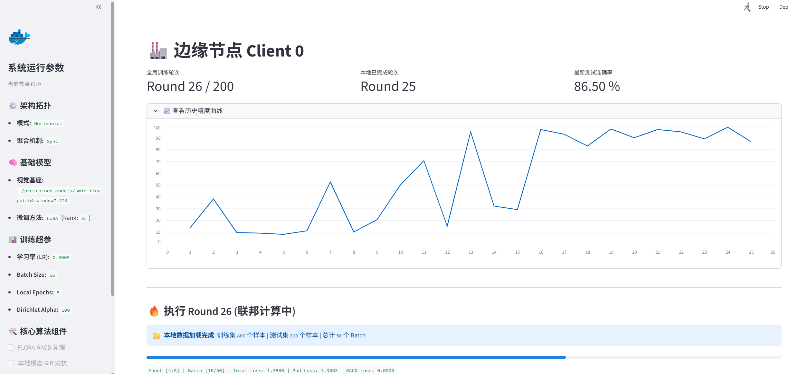
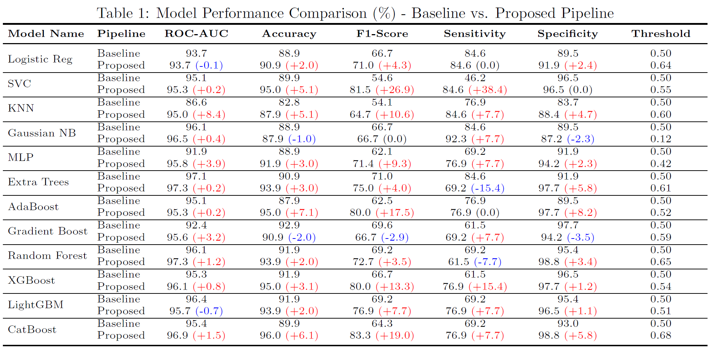
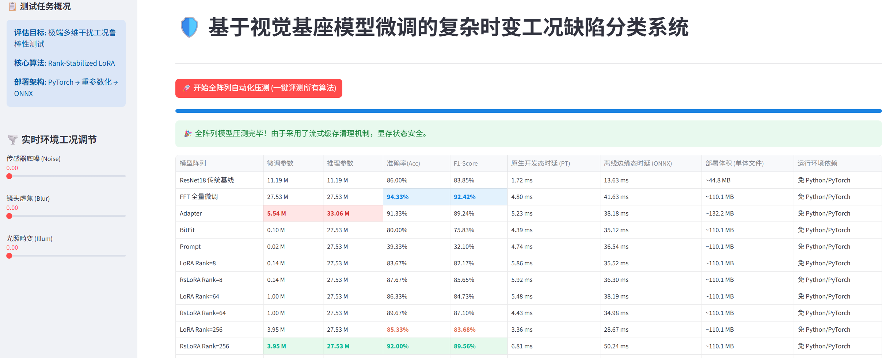
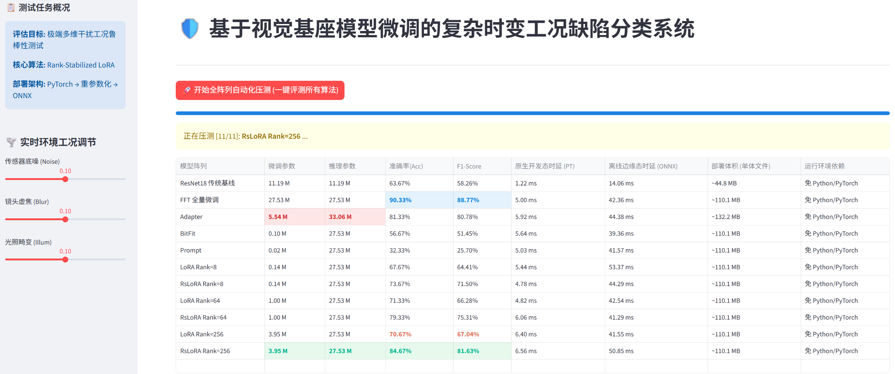

# JixuanCui-ProjectInfo

# 崔继轩 - AI 算法工程师项目报告

你好！我是崔继轩。本仓库展示了我在简历中提到的核心 AI 算法项目的可视化效果与演示。

---

## 1. 基于联邦学习的分布式多模态基座模型微调平台（通用联邦学习平台）
> **关键词：** 云边协同 | 基座模型+LoRA | 异构适配算法 | 全链路监控

*图 1：服务器端监测页面（三用户为例展示测试准确率指标）*

 
 

*图 2：用户端监测页面*

 
 

---

## 2. 基于条件扩散生成模型的医疗重症辅助诊断桌面系统
> **关键词：** 条件扩散生成 (CDDPM) | Tauri+Vue3 | ONNX 毫秒级推理

https://github.com/user-attachments/assets/4e5dc410-2bb6-41c2-91e2-9904b0e67327

*演示 1：基于 Tauri 提权静默抓取 28 项生化指标，完成毫秒级无感推理*

 
 

*图 3：引入聚类引导 CDDPM 扩充少数类样本后，相比于SMOTE数据增强，在12种基线模型上平均 F1 分数提升9.45%，准确率提升2.95%，最优 CatBoost 模型准确率达95.96%（+6.06%），F1分数达83.33%（+19.04%）*

 
 

---

## 3. 基于视觉基座模型微调的复杂时变工况缺陷分类系统
> **关键词：** RsLoRA | 抗高频噪声 | 重参数化 + ONNX

*图 4：无干扰工况下，模型以极低微调参数（3.95M vs. 全微调 27.53M）逼近性能上限（92.00% vs. 94.33%）*

 
 

*图 5：混合干扰工况下，模型相较于同等部署成本传统 LoRA（70.67%）、更高部署成本 Adapter（81.33%），展现出更高的鲁棒性（84.67%）*

---
📫 **联系方式:** jixuancui@njust.edu.cn | 📱 13966116170
